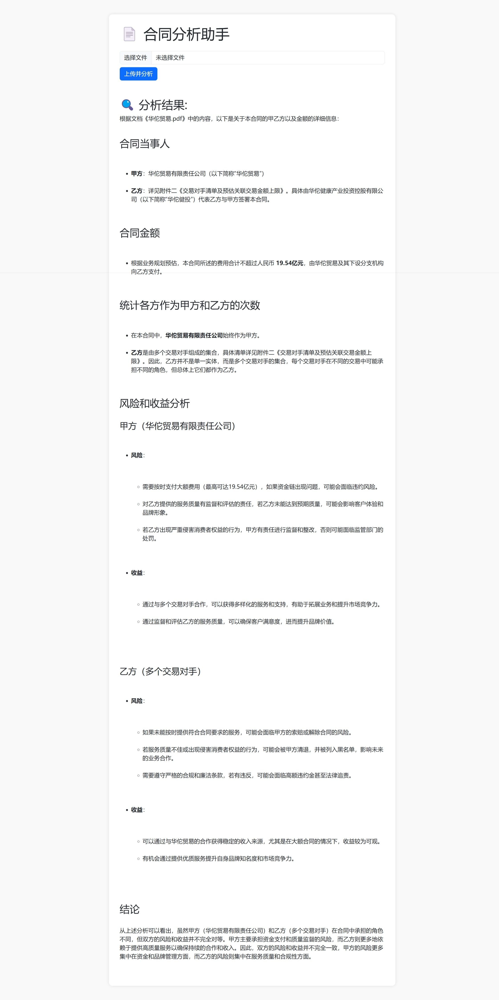

# 合同分析助手 📄

这是一个基于 Flask 和阿里云 DashScope API 的简单合同分析工具。该工具允许用户上传合同文件，自动提取甲乙方信息及金额，并评估合同中的风险与收益是否平衡。

### 🔧 功能特性

- 支持上传任意文档并解析内容（通过 DashScope API）
- 提取合同中甲方、乙方和金额信息
- 统计各方作为甲方和乙方的次数
- 判断双方承担的风险和收益是否一致
- 使用 Bootstrap 5 和 Marked.js 渲染 Markdown 格式的分析结果

### 🖼️ 界面展示



### ⚙️ 技术栈

- Python 3.x
- [Flask](https://flask.palletsprojects.com/) - Web 框架
- [OpenAI 客户端](https://github.com/openai/openai-python) - 用于调用 DashScope API
- [Marked.js](https://marked.js.org/) - Markdown 渲染
- [Bootstrap 5](https://getbootstrap.com/)

### 📦 依赖安装

请先确保已安装 `pip`，然后运行以下命令安装依赖：

```bash
pip install -r requirements.txt
```


### ▶️ 如何运行

1. 克隆项目到本地：
   ```bash
   git clone <your-repo-url>
   cd hetongchuli
   ```


2. 安装依赖：
   ```bash
   pip install -r requirements.txt
   ```


3. 运行应用：
   ```bash
   python main.py
   ```


4. 打开浏览器访问：http://localhost:5000

### ✅ 注意事项

- 需要有效的 DashScope API 密钥，替换代码中的 `sk-xxxxxxxxxxxxxxxxxxx`
- 目前仅支持文本可提取的文档格式（如 `.txt`, `.docx`, `.pdf` 等）

---
